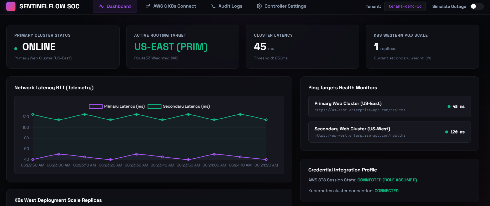

# SentinelFlow SOC - SaaS K8s & AWS Route53 Traffic Controller

SentinelFlow SOC is a **Multi-Tenant Disaster Recovery & Traffic Failover Controller**. It continuously monitors production endpoint latencies, automatically triggers AWS Route53 DNS weighted record adjustments on service failure, and dynamically scales Kubernetes container replicas to handle failover traffic load.



---

## 🌟 Key Features

1. **Multi-Tenant Partitioning**: SQLite database schema separating metrics, endpoints, configurations, and logs isolated by a unique `tenant_id`.
2. **AWS STS AssumeRole Routing**: Uses AWS Security Token Service to securely assume tenant-configured IAM roles using an External ID, eliminating the need to store static account access keys.
3. **Route53 DNS Redirects**: Dynamic Route53 weight updates to instantly shift DNS mappings during failures.
4. **Kubernetes Replica Scale Remediator**: Integrates the official Kubernetes API to scale deployment replicas up to handle incoming failover traffic (e.g., scaling backup pods from `1` to `10`) and scaling them back down during recovery.
5. **Real-time Telemetry Dashboard**: A glassmorphic, obsidian-lavender web operations console displaying response times, container scaling records, live logs, and configuration inputs.
6. **Graceful Simulator Fallback**: Automatically activates a high-fidelity simulator mode when live credentials are not set, allowing full failover testing.

---

## 📁 Project Directory Structure

```text
k8s-failover-controller/
│
├── database.py                 # SQLite schema migration and data seeding
├── remediator.py               # STS assumption, Route53 logic, K8s scaling loop
├── main.py                     # FastAPI REST routes and checker daemon
├── failover.db                 # SQLite database file
├── dashboard_screenshot.png    # Dashboard screenshot
├── start_public.ps1            # Exposes the server to a public HTTPS url via ngrok
│
└── static/                     # Web assets
    ├── index.html              # HTML entrypoint (React, Babel Standalone, Chart.js)
    ├── index.css               # Obsidian & Lavender visual styles
    └── App.jsx                 # React UI layout, charts, forms, and simulator
```

---

## 🚀 Running and Exposing the App

### 1. Prerequisite Packages
Install Python requirements (FastAPI, Uvicorn, Boto3, Kubernetes client):
```bash
C:\Users\91928\AppData\Local\Python\pythoncore-3.14-64\python.exe -m pip install fastapi uvicorn requests boto3 kubernetes
```

### 2. Option A: Run Locally (Localhost Only)
Run the FastAPI web backend:
```bash
C:\Users\91928\AppData\Local\Python\pythoncore-3.14-64\python.exe -m uvicorn main:app --host 127.0.0.1 --port 8000
```
Open **`http://127.0.0.1:8000`** in your browser to view the dashboard.

### 3. Option B: Run Publicly (Shareable Tunnel)
Right-click on **`start_public.ps1`** and select **Run with PowerShell** (or execute `./start_public.ps1` in a PowerShell terminal). 
This script:
1. Launches the FastAPI uvicorn server in a new background window.
2. Launches `ngrok` in your current terminal to establish a secure tunnel.
3. Outputs a public URL (e.g. `https://xxxx.ngrok-free.app`) that anyone on the internet can access!

---

## 🔬 Testing the Automated Failover

1. **Start the Checker Daemon**: Go to the **Controller Settings** tab and click **Start Monitoring Daemon**.
2. **Launch Outage Simulation**: Toggle the **Simulate Outage** switch in the top navbar.
3. **Monitor Redirection**:
   - The primary endpoint status will shift to `OFFLINE`.
   - The active routing target switches to `US-WEST (Secondary)`.
   - The K8s Western deployment scales from `1` to `10` replicas.
   - The graphs under **Dashboard** will dynamically plot the latency spike and container replica scaling.
   - Telemetry logs appear in the **Audit Logs** tab.
4. **Initiate Recovery**: Toggle the simulation switch off. The daemon will restore Route53 entries and scale the K8s deployment back down to `1` replica.
